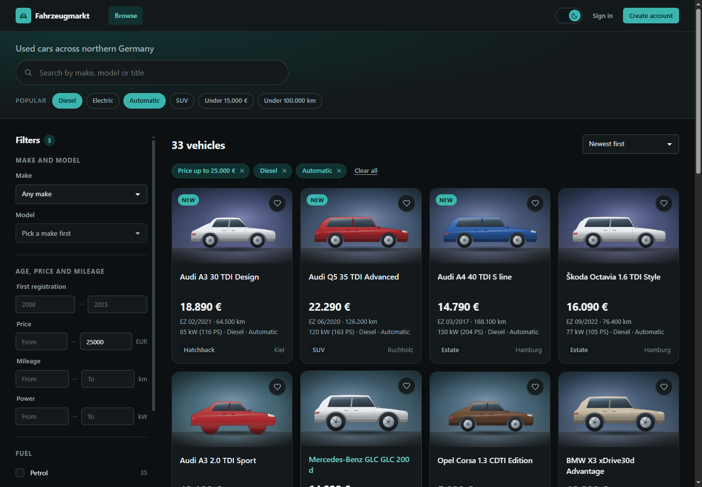
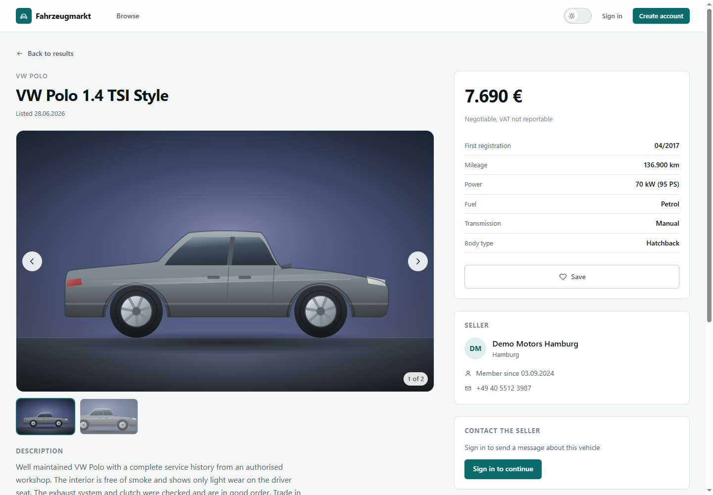

# Fahrzeugmarkt

Fahrzeugmarkt is a used-vehicle marketplace prototype built around German market conventions: prices in EUR, mileage in km, power in kW with PS alongside, first registration and next inspection (HU) dates. Buyers browse a paginated grid of listings and narrow them with combinable filters (make and model, year, price, mileage, power, fuel type, transmission, body type, free-text search) that resolve entirely in SQL and come back with live facet counts; filter state lives in the URL, so results are shareable and the back button behaves. Sellers register, publish listings with uploaded photos, and track saves and inquiries from a dashboard; admins work a moderation queue of flagged listings. The stack is Vue 3 with TypeScript on the front, Java 21 and Spring Boot 3.5 with Spring Data JPA and Flyway on the back, PostgreSQL underneath, all wired together by Docker Compose.

**Live demo: [fullbuild.ai/prototype/fahrzeugmarkt](https://fullbuild.ai/prototype/fahrzeugmarkt)** — sign in with any account in the table below. The demo database is public and writable, so treat anything in it as disposable.





## How the demo is deployed

The API and PostgreSQL run on Railway, built from `backend/Dockerfile` with the repository root as the build context. The front end is built for a sub-path and served as static files by the host site:

```bash
cd frontend
PUBLIC_BASE=/prototype/fahrzeugmarkt/ VITE_API_PREFIX=/prototype/fahrzeugmarkt npm run build
```

The host proxies `/prototype/fahrzeugmarkt/api/*` through to the Railway service rather than the browser calling it directly, which keeps the session cookie first-party and avoids needing CORS or `SameSite=None`. Both variables are unset in local development, where Vite proxies `/api` straight to the backend.

## Run it

With Docker:

```bash
docker compose up --build
```

Then open http://localhost:3000. Compose starts PostgreSQL, waits for it to pass `pg_isready`, runs the Flyway migrations and seed on API startup, and serves the built SPA through nginx, which proxies `/api` to the API container.

Without Docker, run the two halves separately. The backend boots an in-process embedded PostgreSQL under the `local` profile, so nothing needs to be installed:

```bash
cd backend
./mvnw spring-boot:run -Dspring-boot.run.profiles=local
```

```bash
cd frontend
npm install
npm run dev
```

The API listens on http://localhost:8080 and the Vite dev server on http://localhost:5173, proxying `/api` to the API.

## Demo accounts

All demo accounts use the password `demo1234`.

| Email | Role | What it shows |
| --- | --- | --- |
| `buyer@demo.de` | BUYER | Saved listings, contacting a seller |
| `seller@demo.de` | SELLER | Seller dashboard with own listings, inquiries, listing editor |
| `admin@demo.de` | ADMIN | Moderation queue with pre-flagged listings |

## Stack mapping

| Requirement | Where it lives |
| --- | --- |
| Vue 3, Composition API, TypeScript | [`frontend/src`](frontend/src), where every component is `<script setup lang="ts">`, DTO types in [`frontend/src/types.ts`](frontend/src/types.ts), state in Pinia stores under [`frontend/src/stores`](frontend/src/stores) |
| Java 21, Spring Boot 3.x | [`backend/pom.xml`](backend/pom.xml) pins Spring Boot 3.5.16 and `java.version` 21; REST layer in [`backend/src/main/java`](backend/src/main/java) |
| PostgreSQL, Spring Data JPA | JPA entities and repositories in [`backend/src/main/java`](backend/src/main/java); PostgreSQL 17 in [`docker-compose.yml`](docker-compose.yml) |
| Flyway migrations | [`backend/src/main/resources/db/migration`](backend/src/main/resources/db/migration), holding `V1__schema.sql` (tables plus indexes with purpose comments) and the generated `V2__seed_data.sql` |
| SQL-side search and filtering | JPA Specifications joining listings to vehicles, models and makes, plus GROUP BY facet queries, in [`backend/src/main/java`](backend/src/main/java); nothing is filtered in memory |
| Docker Compose | [`docker-compose.yml`](docker-compose.yml), [`backend/Dockerfile`](backend/Dockerfile), [`frontend/Dockerfile`](frontend/Dockerfile), [`frontend/nginx.conf`](frontend/nginx.conf) |
| Seed data | [`scripts/generate-seed.mjs`](scripts/generate-seed.mjs), deterministic generator for 220 listings across German-market makes |

## Tests

Backend tests run against an embedded PostgreSQL with the real migrations and seed applied, covering combined-filter narrowing, sort order, facet counts, the auth wall and ownership checks:

```bash
cd backend
./mvnw test
```

Frontend component tests run headless under Vitest:

```bash
cd frontend
npm test
```

## Documentation

[`ARCHITECTURE.md`](ARCHITECTURE.md) covers the data model, the API surface, the auth model, and how an existing legacy marketplace would be moved onto this architecture incrementally. [`docs/SPEC.md`](docs/SPEC.md) is the build contract the implementation follows.
